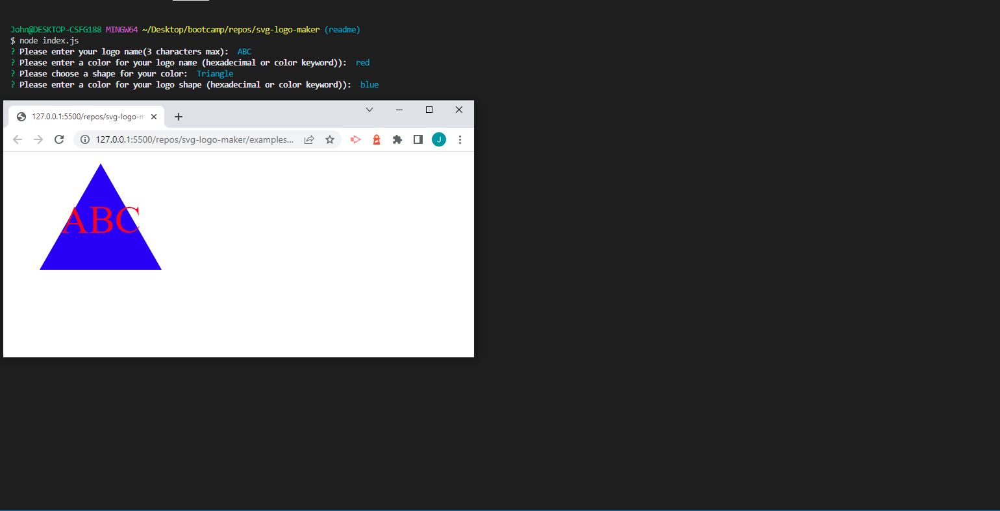

# svg-logo-maker
Command Line application used to create an SVG Logo based on user input


## Description
Main Topic: JavaScript (Inquirer, Jest, FileSystem)

This application was built with Javscript. A function called generateLogo prompts the user for input about their desired logo, after all prompts have been answered the function will render the selected shape to the page. There is a shapes file in our application that holds all of our shape objects that our generateLogo function uses with the given parameters to create a logo. After the logo has been fully created, the html created from the function is written to a blank svg file with the fs package allowing the new logo to be displayed in a web browser.


## Screenshot



## Link
[Click here]()


## Developed by:
```
John Foxwell
```


